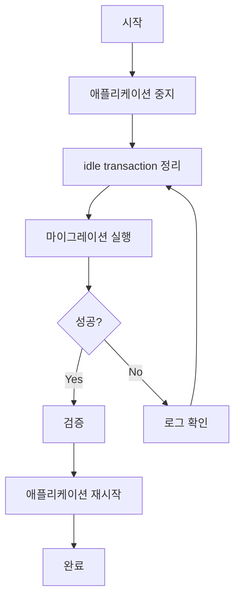
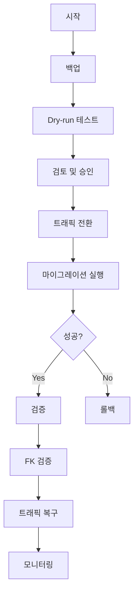

# PostgreSQL Schema & Data Migration Guide

## 📋 목차

1. [사전 준비](#사전-준비)
2. [정상 마이그레이션 절차](#정상-마이그레이션-절차)
3. [예외 상황 대처](#예외-상황-대처)
4. [스크립트 설명](#스크립트-설명)
5. [트러블슈팅](#트러블슈팅)

---

## 🔧 사전 준비

### 1. Python 가상 환경 활성화

```bash
# Mac/Linux
source .venv/bin/activate

# Windows
.venv\Scripts\activate
```

### 2. 설정 확인

`config.yaml` 파일에서 source와 target 데이터베이스 설정 확인

```yaml
source:
  host: source-host
  port: 5432
  dbname: postgres
  user: postgres
  password: your-password

targets:
  gcp_test:
    host: target-host
    port: 5432
    dbname: postgres
    user: postgres
    password: your-password
```

---

## 🚀 정상 마이그레이션 절차

### 스키마 마이그레이션

```bash

python src/pg_schema_sync/__main__.py --commit

```

### 데이터 마이그레이션

```bash

python src/pg_schema_sync/__main__.py --with-data

```

### Option 3: 검증만 (변경 없이 차이점 확인)

```bash

python src/pg_schema_sync/__main__.py --verify

```

---

## ⚠️ 예외 상황 대처

### 상황 1: "idle in transaction" 에러

**증상:**

```
canceling statement due to lock timeout
```

**원인:**
이전 마이그레이션이 완료되지 않고 좀비 연결로 남아있음

**해결 (Mac/Linux):**

```bash

# 또는 Python 스크립트 사용
python kill_idle_transactions.py --yes
```

**해결 (Windows):**

```powershell
# Python 스크립트 사용 (크로스 플랫폼)
python kill_idle_transactions.py --yes
```

---

### 상황 2: Lock timeout 반복 발생

**증상:**
FK drop이나 ALTER TABLE이 계속 timeout이거나 drop 도중에 무한 대기 상태가 발생

**원인:**

- 다른 애플리케이션이 연결 중

**해결 방법:**

#### A. 마이그레이션 중 Lock 발생 시 (가장 빠름)

**마이그레이션이 이미 실행 중**이고 FK drop에서 멈춘 경우:

```bash
# 다른 터미널에서 실행 (마이그레이션은 중단하지 말고 계속 실행 중)
./kill_others.sh

# 또는 Mac/Linux
bash kill_others.sh
```

> 💡 **실전 팁:** FK drop 단계에서 lock timeout이 발생하면, 마이그레이션을 중단하지 말고  
> 다른 터미널에서 `kill_others.sh`를 실행하면 바로 진행됩니다!

**kill_others.sh가 하는 일:**

- ✅ idle in transaction 제거
- ✅ PostgREST 연결 종료
- ✅ 오래된 idle 연결 제거 (5분 이상)
- ✅ 남은 연결 현황 표시

---

#### B. 마이그레이션 시작 전 정리 (권장)

```bash
# 다른 애플리케이션 서버/워커 중지
# (예: API 서버, 백그라운드 워커, 스케줄러 등)

# idle in transaction 제거
python kill_idle_transactions.py --yes

# 마이그레이션 실행 (둘 중 하나 선택)
python -m src.pg_schema_sync --with-data
# 또는
python src/pg_schema_sync/__main__.py --with-data

# 완료 후 애플리케이션 재시작
```

---

#### C. 연결 상태 확인

```bash
python check_connections.py
```

---

### 상황 3: 마이그레이션 중간에 멈춤

**증상:**
진행률이 오래 멈춰있거나 FK drop에서 계속 skip 메시지 출력

```
⏭️ Skipped (busy): cur_option_set_schema.some_fkey
⏭️ Skipped (busy): menu_items.another_fkey
```

**진단:**

```bash
# 다른 터미널에서 현재 상태 확인
python check_connections.py

# WAITING lock이 있는지 확인
# Output에서 "⏳ WAITING" 확인
```

**해결 (빠른 방법):**

```bash
# 다른 터미널에서 실행 (마이그레이션은 중단하지 말 것!)
./kill_others.sh

# 마이그레이션이 즉시 진행됨
```

**해결 (수동 방법):**

```bash
# idle in transaction이 있으면 제거
PGPASSWORD=postgres psql -h 127.0.0.1 -p 54322 -U postgres -d postgres -c "
SELECT pg_terminate_backend(pid)
FROM pg_stat_activity
WHERE state = 'idle in transaction';"
```

---

### 상황 4: Import 에러 (ModuleNotFoundError)

**증상:**

```
ModuleNotFoundError: No module named 'dataMig'
```

**원인:**
상대 import 경로 문제

**해결:**
`src/pg_schema_sync/__main__.py` 파일에서:

```python
# 잘못된 경우
from dataMig import run_data_migration_parallel

# 올바른 경우
from .dataMig import run_data_migration_parallel
```

또는:

```bash
# 프로젝트 루트에서 실행
cd /Users/iseong-won/Desktop/OQ/pg-schema-sync
python -m src.pg_schema_sync --with-data
```

---

### 상황 5: Sequence 값 불일치

**증상:**
마이그레이션 후 새 레코드 삽입 시 PK 충돌

**원인:**
IDENTITY 시퀀스 값이 테이블 MAX(id)보다 작음

**해결:**
마이그레이션에 자동으로 포함됨. 수동으로 확인하려면:

```sql
-- 시퀀스 값 확인
SELECT last_value FROM table_name_id_seq;
SELECT MAX(id) FROM table_name;

-- 수동 조정
SELECT setval('table_name_id_seq', (SELECT MAX(id) FROM table_name), true);
```

---

## 📚 스크립트 설명

### 1. `src/pg_schema_sync/__main__.py`

**메인 마이그레이션 스크립트**

**두 가지 실행 방법:**

```bash
# 방법 1: 모듈로 실행 (권장)
python -m src.pg_schema_sync [옵션]

# 방법 2: 직접 실행
python src/pg_schema_sync/__main__.py [옵션]
```

> 💡 **방법 1을 권장하는 이유:** `-m` 옵션은 Python 모듈 경로를 자동으로 설정하여  
> 상대 import 에러(`from .dataMig import ...`)를 방지합니다.

**옵션:**

```bash
--verify           # 스키마 차이점만 확인 (변경 없음)
--with-data        # 데이터 마이그레이션 포함
--no-commit        # SQL 생성만 하고 실행 안함
--use-alter        # ALTER TABLE 사용 (실험적)
--commit           # 테이블, 시퀀
```

**실행 예시:**

```bash
# 스키마 + 데이터 마이그레이션 (가장 많이 사용)
python -m src.pg_schema_sync --with-data

# 검증만
python src/pg_schema_sync/__main__.py --verify

# SQL만 생성
python -m src.pg_schema_sync --no-commit
```

**생성되는 파일:**

- `history/migrate.gcp_test.YYYYMMDDHHMMSS.sql` - 실행된 마이그레이션 SQL
- `history/skip.gcp_test.YYYYMMDDHHMMSS.sql` - 스킵된 객체들

---

### 2. `check_connections.py`

**데이터베이스 연결 상태 확인**

```bash
python check_connections.py
```

**출력 정보:**

- 활성 연결 목록 (PID, User, State, Query)
- Lock 상태 (GRANTED / WAITING)
- 연결 통계

---

### 3. `kill_idle_transactions.py`

**Idle in transaction 연결 제거 (크로스 플랫폼)**

```bash
# 대화형
python kill_idle_transactions.py

# 자동 실행
python kill_idle_transactions.py --yes
```

**제거 대상:**

- `idle in transaction` 상태 연결
- superuser 제외 (권한 부족으로 제외)

**사용 시점:**

- 마이그레이션 시작 **전**

---

### 4. `kill_others.sh` (Mac/Linux only)

**마이그레이션 중 방해되는 연결 제거**

```bash
./kill_others.sh

# 또는
bash kill_others.sh
```

**제거 대상:**

- ✅ idle in transaction
- ✅ PostgREST 연결
- ✅ 오래된 idle 연결 (5분 이상)

**사용 시점:**

- 마이그레이션이 **실행 중**일 때
- FK drop에서 lock timeout으로 멈춘 경우
- **다른 터미널에서 실행** (마이그레이션은 계속 실행 중)

> 💡 **실전 꿀팁:** FK drop 단계에서 다음과 같은 메시지가 계속 뜨면:
>
> ```
> ⏭️ Skipped (busy): cur_option_set_schema.some_fkey
> ```
>
> 마이그레이션을 중단하지 말고 **다른 터미널**에서 `./kill_others.sh` 실행!  
> 대부분의 FK가 즉시 drop됩니다.

---

## 🔍 트러블슈팅

### 자주 발생하는 문제들

#### 1. "connection already closed" 에러

**원인:**
마이그레이션 실행 중에 `kill_idle_transactions.py` 실행

**해결:**

- ❌ 마이그레이션 **실행 중**에는 kill 스크립트 실행 금지
- ✅ 마이그레이션 **시작 전**에만 실행

**올바른 순서:**

```bash
# 1. idle 정리
python kill_idle_transactions.py --yes

# 2. 3초 대기
sleep 3

# 3. 마이그레이션 시작 (실행 중에는 건드리지 않기!)
python -m src.pg_schema_sync --with-data
```

---

#### 2. 반복적으로 같은 테이블에서 멈춤

**진단:**

```bash
python check_connections.py
```

특정 테이블에 계속 lock이 걸려있다면:

**해결:**

```bash
# Option A: 해당 테이블만 제외하고 마이그레이션
# src/pg_schema_sync/dataMig.py의 SKIP_TABLES에 추가
SKIP_TABLES = {'slow_request_logs', 'member_action_log', 'problem_table'}

# Option B: 애플리케이션 중지 후 재시도
# 데이터베이스에 접근하는 모든 애플리케이션 중지
```

---

#### 3. Lock timeout이 너무 짧거나 길 때

**현재 설정 (dataMig.py):**

```python
lock_timeout = '3s'        # 3초 후 skip
statement_timeout = '10s'  # 10초 후 전체 실패
```

**조정 방법:**

너무 많이 skip되면 (timeout 증가):

```python
cur.execute("SET lock_timeout = '10s';")
```

너무 오래 걸리면 (timeout 감소):

```python
cur.execute("SET lock_timeout = '2s';")
```

---

**원인:**

- 바쁜 테이블에서 lock을 얻지 못함
- 또는 참조 무결성 위반

---

## 💡 Best Practices

### 1. 로컬 개발 환경 (PostgreSQL Docker)

**환경:**

- 순수 PostgreSQL Docker 컨테이너 사용
- 부가 서비스 없음 (깨끗한 환경)

**장점:**

- ✅ Lock 충돌 최소화
- ✅ 빠른 마이그레이션
- ✅ 예측 가능한 동작

**권장 방법:**

```bash
# PostgreSQL만 실행 중인지 확인
docker ps | grep postgres

# 애플리케이션 서버가 있다면 중지
# (API 서버, 워커, 스케줄러 등)

# idle transaction 정리
python kill_idle_transactions.py --yes

# 마이그레이션
python -m src.pg_schema_sync --with-data

# 완료 후 애플리케이션 재시작
```

---

### 2. 프로덕션 환경

**사전 작업:**

1. 데이터베이스 백업
2. 트래픽 분석 (가장 조용한 시간 파악)
3. Dry-run 테스트
   ```bash
   python -m src.pg_schema_sync --no-commit
   # 생성된 SQL 검토
   ```

**실행:**

1. Read replica로 트래픽 전환
2. 마이그레이션 실행
3. 검증
4. 트래픽 복구

---

### 3. 대용량 테이블

**문제:**

- INSERT가 오래 걸림
- Lock timeout 발생

**해결:**

```python
# SKIP_TABLES에 추가하고 별도 처리
SKIP_TABLES = {'huge_table_1', 'huge_table_2'}

# 해당 테이블은 별도 스크립트로 처리
# - COPY 명령 사용
# - 배치 사이즈 증가
# - 또는 dump/restore 사용
```

---

## 🎯 권장 워크플로우

### 개발/테스트 환경



### 프로덕션 환경



---

## 📞 문제 발생 시

1. **로그 확인**

   - 터미널 출력 저장
   - `history/` 디렉토리의 SQL 파일 확인

2. **상태 진단**

   ```bash
   python check_connections.py
   ```

3. **긴급 복구**

   - 백업에서 복원
   - 또는 수동 롤백 SQL 실행

4. **재시도 전 확인**
   - 모든 idle in transaction 제거
   - 애플리케이션 연결 상태 확인
   - Lock 상태 확인

---

## 📝 체크리스트

### 마이그레이션 전

- [ ] 백업 완료
- [ ] config.yaml 설정 확인
- [ ] venv 활성화
- [ ] idle transaction 정리
- [ ] (선택) 애플리케이션 서버 중지

### 마이그레이션 중

- [ ] 진행상황 모니터링

### 마이그레이션 후

- [ ] 애플리케이션 테스트

---

## 🔗 관련 파일

```
pg-schema-sync/
├── src/pg_schema_sync/
│   ├── __main__.py              # 메인 마이그레이션 스크립트
│   └── dataMig.py               # 데이터 마이그레이션 로직
├── config.yaml                  # DB 설정
├── check_connections.py         # 연결 상태 확인
├── kill_idle_transactions.py    # Idle transaction 정리 (시작 전)
├── kill_others.sh              # 방해 연결 제거 (실행 중) [Mac/Linux]
├── history/                    # 마이그레이션 히스토리
│   ├── migrate.*.sql
│   └── skip.*.sql
└── MIGRATION_GUIDE.md          # 이 문서
```

---

**마지막 업데이트:** 2025-12-01
**버전:** 1.0
스
